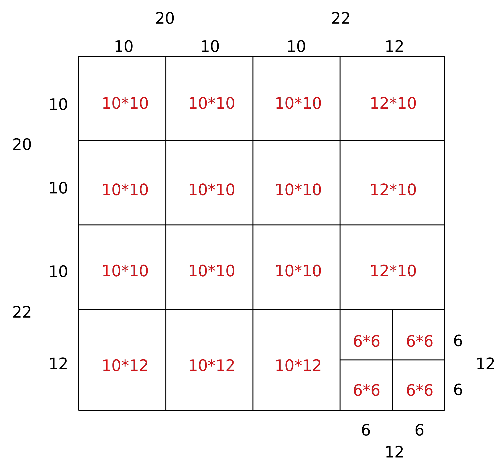

## Knight's Tour

A visual exploration of local search algorithms which generate solutions to the Knight's Tour Problem. The paths are beautiful because of the symmetrical characteristics of the different algorithms.

### VIEW LIVE: https://matthew-howe.github.io/knights-tour/


## Steps for running
```
git clone https://github.com/matthew-howe/knights-tour.git
cd knights-tour
npm install
npm run start
```


## Algorithms

  **Warnsdorf's Rule**  
  [**Source**](https://github.com/matthew-howe/knights-tour/blob/master/src/algorithms/warnsdorf.js)  
    Will move the knight so that it always proceeds to the square form which the knight will have the fewest onward moves. (Not including squares already visited.)

  **Divide and Conquer**   
  [**Source**](https://github.com/matthew-howe/knights-tour/blob/master/src/algorithms/divideandconquer.js)  
  The code is an implementation of _Parberry, Ian. "An efficient algorithm for the Knight's tour problem." Discrete Applied Mathematics 73.3(1997):251-260_.

  A knight’s tour is called _**closed**_ if the last square visited is also reachable from the first square by a knight’s move.

  A knight’s tour is said to be _**structured**_ if it includes the knight’s moves shown in Fig. 1.

  

  An _n_ \* _n_ chessboard has a closed knight's tour iff _n_ ≥ 6 is even.

  For board size of 6 \* 6, 6 \* 8, 8 \* 8, 8 \* 10, 10 \* 10, and 10 \* 12, we have already found **structured**, **closed** knight’s tours, which are shown in Fig. 2.

  

  This means the problem is already solved when _n_ ∈ {6, 8, 10}.

  For larger _n_, divide the chess board into parts to meet the sizes above. For instance, a board with _n_ = 42 can be divided as follows:

  

  Then connect the parts together. Since all the parts are structured, we can combine them by substitute the directions on the corners:

  

  ### Data Structure

  Since every point is connected with other two points, and there are only 8 possible directions (from 0 to 7):

  

  The 6 pre-defined tours are stored in 2-dimensional arrays.

  There are 8 types of corners (as were shown in Fig. 3.), which are denoted by 0-7, is recorded in _**point attribute**_. Besides, the point attribute of ordinary points is 8.

  **Nueral Network Solution**  
    The neural network is designed such that each legal knight’s move on the chessboard is represented by a neuron. Therefore, the network basically takes the shape of the knight’s graph over an n×n chess board. (A knight’s graph is simply the set of all knight moves on the board)
